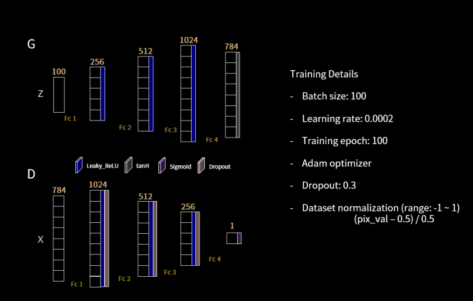

# Unsupervised Learning by Generative Adversarial Nets

Generative Adversarial Networks (GANs) are implemeted here for an unsupervised task (here image generation).

* The architecture of the generator and discriminator is used as follow:

* After removing the dropout the training loss is plotted.
* To check the model's progress, the images are generated at 10th epoch, the 20th epoch, the 50th epoch, the 100th epoch.

Critical analysis of the trends in GANs is also done. The original paper can be found here: [Generative Adversarial Nets](https://arxiv.org/pdf/1406.2661.pdf)